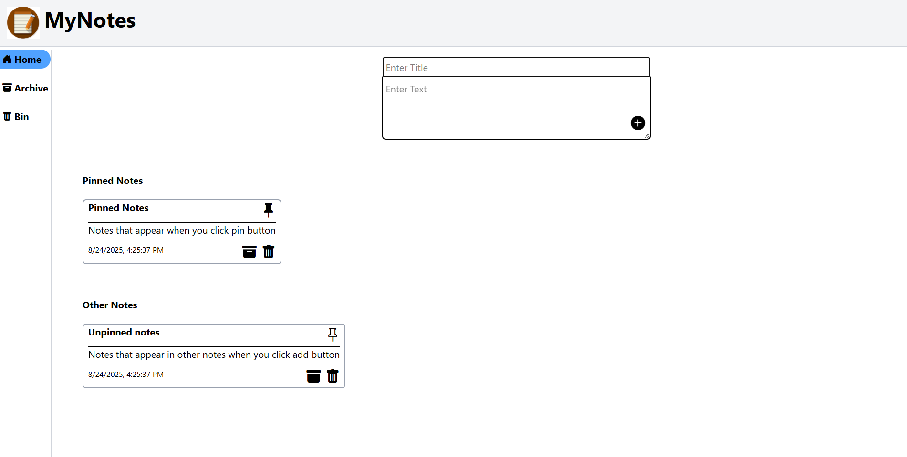
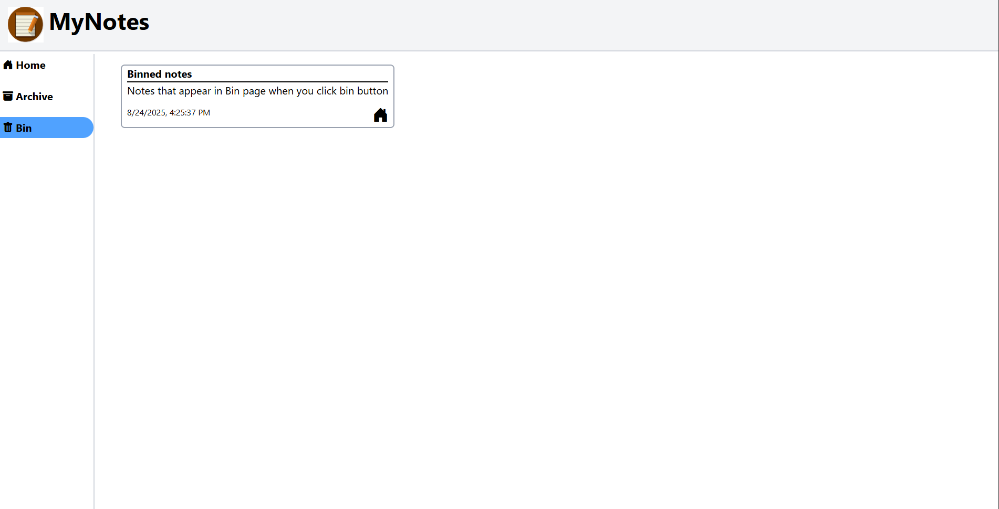
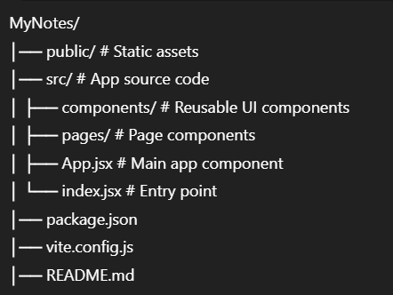

# 📝 MyNotes  

A clean and minimal **note-taking web app** built with **React + Vite**.  
Easily create, manage, and delete notes with a smooth and responsive UI.  

---

## 🚀 Features  

- ✅ Create, edit, and delete notes  
- ✅ Beautiful, minimal, and responsive UI  
- ✅ Fast and lightweight (built with Vite + React)  
- ✅ Auto-save notes in local storage  
- ✅ Dark/Light mode toggle  

---

## 📸 Screenshots  

### 🏠 Homepage  

### 📂 Archive Page  
  

### 🗑️ Bin Page  
  

---

## 🛠️ Tech Stack  

- ⚛️ React  
- ⚡ Vite  
- 🎨 Tailwind CSS  
- 💾 LocalStorage  

---

## 📂 Project Structure  
  

